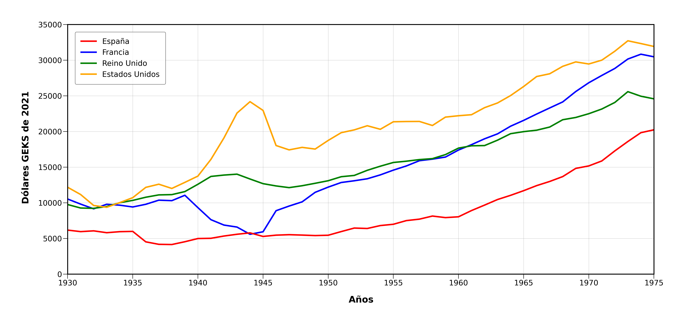
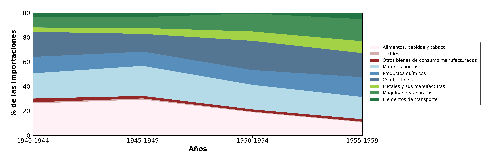
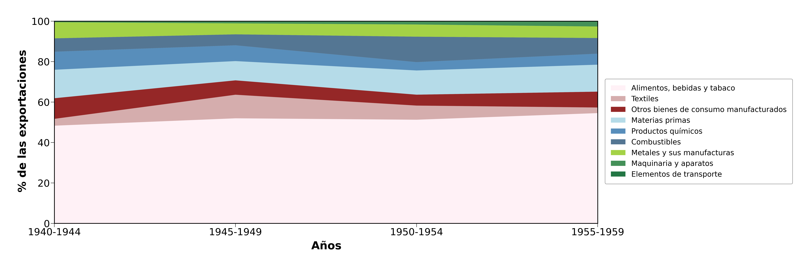
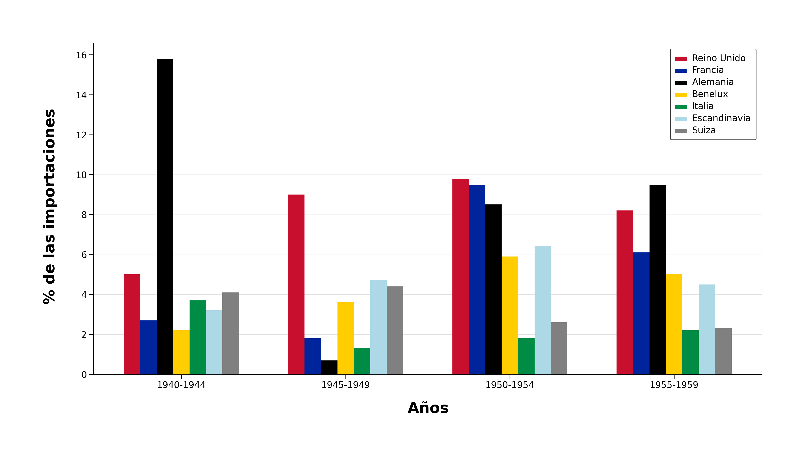
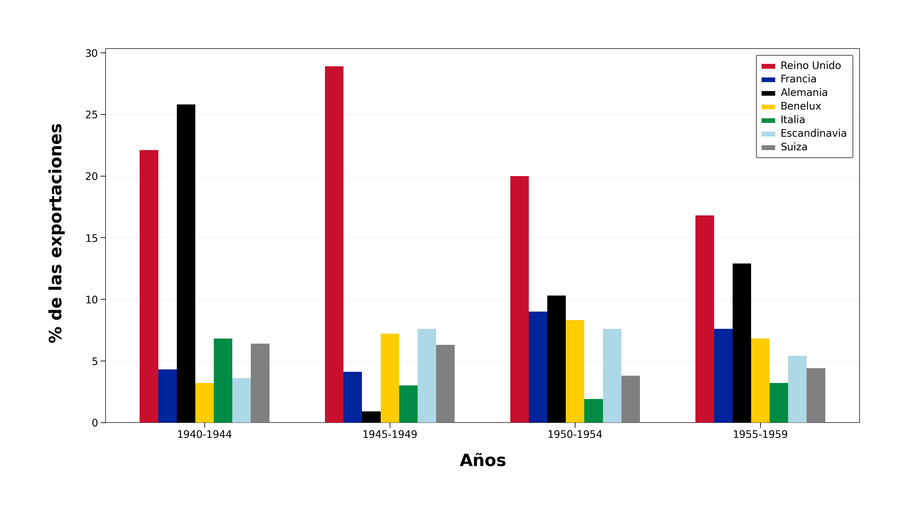

# Analysis of the Spanish foreign sector between 1940 and 1959

In this repository you will find scripts and datasets that allow us to analyze different aspects of Spanish foreign sector between 1940 and 1959.

This work is a small part of my bachelor thesis "Análisis de las licencias de importación en la Comunidad de Madrid entre 1947 and 1959" that you can find on

## GDP

## Exports and Imports as % of GDP

## Structure

## Origins and Destinations

